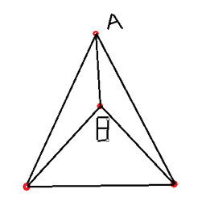
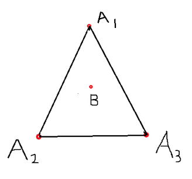
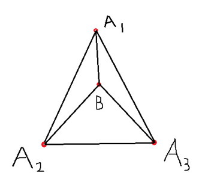
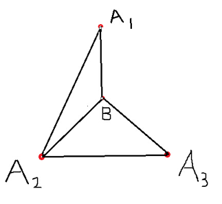
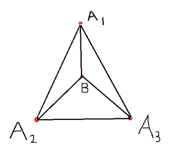

# 新人扫盲贴

**（欢迎大家指正并修改~）**

**严谨一切作弊——飞机（fakeGps）、互刷等行为。一旦发现，全体举报！**

几个必备网址：

[http://www.ingress.com/](http://www.ingress.com/)    官网~

[http://ingresscn.com/](http://ingresscn.com/)      中文网（玩家自译的福利站）

[http://www.ingress.com/intel](http://www.ingress.com/intel)  地图

[http://iitc.jonatkins.com/](http://iitc.jonatkins.com/)  IITC插件（地图插件，注意：非官方插件请慎用）

[http://in-nanjing.com/](http://in-nanjing.com/)   一些玩家做的小站，可以提供一些新手Q&A

[http://tieba.baidu.com/f?kw=ingress](http://tieba.baidu.com/f?kw=ingress)  百度ingress吧

首先欢迎大家加入绿军大家庭！ingress是一个需要点探索精神和脱宅毅力的游戏~所以多出门是必要、必须、必做到的大大大前提。如果你懒得出门，懒得研究~个人建议，不如在家里玩玩PS3或者魔兽神马的，有空调、可乐、炸薯条的日子也是很美好滴！下面写的，也基本都是些技巧、窍门之类的。 看不懂的词，请查阅中文网（尤其英文不好的童鞋们），百度贴吧里则有很多新手提问，应该能解决大部分游戏进不去神马的这类问题。建议新手多多利用搜索功能，不要坐定伸手党 ：）

## 关于流量：

这是个问题~~要说一个月包多少呢，我也不好说，看你玩的程度。这里教大家一个省流量的方法，就是google map有一个离线下载的功能，允许在离线状态下使用。还是可以省下不少的哟！：） 我上下班路上扫扫po，给po充充电啥的，大概20M每天。稍微多走点地方，就30-40M。这个大家根据自己情况可以估算一下。另外一般各高校开学，移动和联通都会有很多划算的套餐办理，具体移动和联通的优惠信息大家可以在群里咨询，会有很多小伙伴提供信息给你。

## 关于XM

就是你地图上看的小白点~游戏界面上，横在最上面的那一条长得像血槽的东东~它是游戏里你一切动作的能量条！根据等级增长会有定额增长。获取方法就是溜达~还有可贵的power cube以及回收道具。

## 关于Hack

敌我双方的portal在距离范围内，都可以hack！敌方给100ap~相对来说道具少一些。友方不给ap，但道具会多一些。道具等级，是取你和塔比较低那一方限制~比如你3级，hack 8级塔也不会得到8级道具！可能RP爆发会得到5级。长按hack会进入画图小游戏界面，界面会先出现一些图形然后让你再按顺序一一画出，如果画对会有额外的道具奖励，一般对的越多画的越快得到的道具就越多（群文件里有画图小插件可以帮助你练习）。Hack时会出现一个叫portal key的东西，这是完成link的必备物品，但是如果你已经有这个portal的key，那么再次hack就不会出了。所以如果你希望得到多把同一个portal的key，可以（1）将已经得到的这个portal的key扔到地上，这个要特别注意你周围是否有敌军，不要被别人捡走啦；（2）将这个portal的key放进胶囊capsule里面，然后再hack。注意：得到portal key也是要很人品的哦！

## 关于res

1级res每人每塔可以放8只。2~4级的放4只。5~6级放2只。7~8级放1只。Res 的远近，是你离portal中心的位置，最理想距离是portal压着你的范围绿圈~这样摆出来res最远，至于为啥要这样摆呢？我们都知道XMP的攻击是随着距离增加而递减的，so~摆放越开，敌军来打就会越费道具。（当然，高级道具攻击范围很远~可习惯是要慢慢养成滴~）

## 关于passcode

是通过解析media所得的相当于道具礼包的东东。【G+好像有人给过破解的一些方法，不过我木有研究过，此处不做过多解释，有兴趣的可以去G+翻翻前辈们的帖子】Media有等级之分，越高等级的passcode存活时间越短（因为世界通用）。所以手慢无哦~获得渠道一般去G+有分享群，还有群里随时有人转发！

## 关于升级：

ap的基本获取请参阅 [http://ingresscn.com/wiki/action-portalints](http://ingresscn.com/wiki/action-points)

XMP炸塔占portal是最基本的。但对于新人我们不建议挑战高级塔，道具和XM都会吃不消，更容易造成废了半天劲打不掉一个res就拿不到一丁点ap！（对，一定要至少打掉一个脚才有ap！）那么hack敌军塔是个很好的升级方法，每个塔每4个小时可以hack4次，就是400ap~帝都现在蓝军人数和活动范围都很大，遍地是蓝portal，所以次方法拿经验同时还能收集不少道具是非常划算的。【你hack它两天就等于它饿了两天。你赚足AP和道具，再回头打它个残血portal~这笔账，你们都懂的算啦：） 】如果你周围绿色portal多，也不用担心，多hack出key连field！经验大大滴。Key是消耗品，用一个少一个，因此我们建议，在连不成field的情况下，大家尽量留着key~一次多赚ap（也就是经验）。

## 关于recharge

当本方他能量不满时就可以进行recharge操作，但条件是（1）你能够的到那个portal或者有那个portal的key；（2）你的XM够充一次。每次充能有10点AP可拿。Portal能来那个不足引起的原因（1）自然衰减，这是游戏设定的没法改变；（2）被敌方攻击。在个人成就里有个recharge和guardian奖章都必须通过此操作才能拿到。

## 关于Mod

每个portal都有四个mod可以加，一个玩家最多加两个mod。Mod是用来增加portal状态的。现在一一讲解每种mod的用途，其中一些有common，rare， very rare之分，从common，rare到very rare表示其作用越明显。Portal shield用来增加portal的防御能力，敌方攻击时就会减少一定的伤害。Link amp增加portal能link的距离。Heat sink减少hack portal的冷却时间。Multi-hack增加portal在过热之前的hack次数。Force amp增加portal攻击敌方玩家的伤害程度。Turret增加portal攻击敌方玩家的频率。一般作防御的portal mod状态时两个shield+force amp+turret，hack比较多就多加multi-hack。

## 关于link

能进行link必须具备以下条件：（1）需要link的两个portal必须八个角全满；（2）必须够到link出发点的portal；（3）必须有被link的portal的key；（4）link出发点的portal的可link距离必须大于两个portal之间的距离； （5）有link操作需要的XM； （6）没有其他link的阻挡。(7) 一个Portal可以链出8条Link，链入无上限。

注意，portal key是消耗品，创建完一条link就会用掉一个key。

另外，link的距离是由出发portal的等级限制的，请新人额外注意这一点，不要不舍得放你手里的高级腿，portal等级高，随后出的物品也越好哟。

| 等级 | 最远距离 |
| --- | --- |
| 1 | 160米 |
| 1.5 | 810米 |
| 2 | 2.56公里 |
| 3 | 12.96公里 |
| 4 | 40.96公里 |
| 5 | 100公里 |
| 6 | 207.36公里 |
| 7 | 384.16公里 |
| 8 | 655.36公里 |

## 关于field

当三个portal之间的三条link全部建立时就会形成一个field。处于field里面的portal不能进行link操作，但是field顶点的portal可以向field里进行link（即field里的portal作为目标portal）。所以四个portal就可以最多连成四个field了，建立link的顺序非常重要，要好好规划哦!

## 关于使用ultra strike

Ultra strike 是用来专门摧毁敌方mod（sheild和turrent）的工具，使用方法和XMP相似，可以续能释放，但是攻击范围十分有限，所以使用Ultra strike摧毁mod时要站在po上，即自己的位置和po位置重合，然后释放，效果更佳。

## 关于多重field

多重field方案的实施是为了利用少量的po创造出更大的field数目，获得更多的ap，是各位agent升级的最佳方案。

根据field里的po不能向外link的原则，做多重field需要注意link的方向和顺序。

简单的说，四个点最多可以连四个field，这样就形成了一个多重field。如果不注意顺序的话只能连接三个field。下面详细讲一下link的方法。

### 1多重方法一

（1）先连一个field

（2）在外围连一个大field盖住原来小的

（3）站在A点link到B点

### 2 多重方法二

（1）先练一个field，但是里面有一个点

（2）依次站在A1、A2、A3连到B点

### 3 普通的三个field

## 关于申请portal

长按游戏屏幕，会出现NEW PORTAL选项，然后会启动相机拍照，然后点击地图进行位置修正，填写portal名字就完成申请。

也可以在游戏外拍照，且照片带有GPS位置信息，然后分享到ingress，点击地图进行位置修正，填写portal名字完成申请。

成功提交后会受到确认邮件，进入漫长的审核等待期。现在审核期大概需要四个月（2014.09.05）。

但是并不是随意的照片都可以进行申请，具体的申请标准参考官方申请原则。

官方的portal申请原则

https://support.google.com/ingress/answer/3066197?hl=zh-Hans&ref\_topic=2799270

## 关于翻墙

想要玩ingress进行翻墙是必须具备的条件，翻墙的方法也有很多，下面从Android和IOS两个方面分别详细说明。

### 1 Android

#### 方法一：fqrouter2

fqrouter2是一个非常好用的且比较稳定的免费App，手机无需root（当然root了功能更全）。Google play商店地址： [https://play.google.com/store/apps/details?id=fq.router2](https://play.google.com/store/apps/details?id=fq.router2)

另赠送一个google play商店apk安装包下载地址，只需要将google play商店中的app网址输入即可下载apk安装包： [http://apps.evozi.com/apk-downloader/](http://apps.evozi.com/apk-downloader/)

#### 方法二：修改hosts文件

用这种方法的前提是手机已root！

将下载到的hosts文件粘贴到/system/etc/hosts，可以使用root explorer等文件管理App进行操作。

Root explorer下载地址： [https://play.google.com/store/apps/details?id=com.clearvisions.explorer](https://play.google.com/store/apps/details?id=com.clearvisions.explorer)

完成后就可以愉快地游戏了。

但是hosts不稳定，需要经常更换。如果不想手动更换，安装SmartHosts这个App可以自动更新hosts。

SmartHosts下载地址： [https://play.google.com/store/apps/details?id=mobi.smarthosts](https://play.google.com/store/apps/details?id=mobi.smarthosts)

#### 方法三：Shadowsocks

Shadorsocks Google Play商店地址： [https://play.google.com/store/apps/details?id=com.github.shadowsocks](https://play.google.com/store/apps/details?id=com.github.shadowsocks)

可以购买Shadorsocks服务或者，使用Shadorsocks公益账号： [https://www.shadowsocks.net/](https://www.shadowsocks.net/)

#### 方法四：VPN

首先得有一个VPN账号，有很多免费的和付费的。 **（需要临时VPN账号的可以到群里找Agent hackCN，大神主动帮助哦。）**

然后在手机上设置VPN就可以了。还是不会的话请点传送门https://www.google.com/webhp?sourceid=chrome-instant&ion=1&espv=2&es\_th=1&ie=UTF-8#newwindow=1&q=android%20vpn%E8%AE%BE%E7%BD%AE

### 2 IOS

#### 方法一：VPN

同Android

#### 方法二：修改hosts文件

用这种方法的前提是手机已越狱！并安装tsProtecter软件。

将下载到的hosts文件粘贴到/etc，可以使用iFile等文件管理App进行操作。

完成后就可以愉快地游戏了。但是hosts不稳定，需要经常更换。

# 附录

| 装备名称 | 用途 |
| --- | --- |
| Resonator | 放置于据点内，为据点注满能量，每个据点最多可放置八个共振器。 |
| Portal Shield | 放置于据点内，为据点提升防御力，每个据点最多可放置四个防护盾。 |
| Portal Key | 连接据点的道具，亦可以 **遥距充电（Remote Recharge）** 。 |
| XMP Burster | 用作攻击敌方据点的道具，等级越高，杀伤力越大。 |
| Ultra Strike　　 | 用作攻击敌方据点的道具，范围小，杀伤力比XMP大，可以拆除Portal Shield。 |
| Media | 内藏暗号的视频，部分为Report。成功解密后可输入密码 **换领（Redeem）** 道具。 |
| Power Cube | 可存储 XM 作应急用，以免攻击敌方据点期间 XM 耗尽。 |
| ADA Refactor | 用以将绿色据点转蓝，转换后会中断据点现存的链接，惟不能赚取任何 AP。 |
| Jarvis Virus | 用以将蓝色据点转绿，转换后会中断据点现存的链接，惟不能赚取任何 AP。 |
| Force amp | 增加portal攻击力（2倍）。 |
| Turret | 提升据点攻击敌方玩家的机会率。 |
| Heat sink | 缩短入侵据点获取道具的等待时间（默认为五分钟）。 |
| Multi-hack | 增加入侵据点次数（默认为每四小时最多四次）。 |
| Link amp | 提升连接邻近据点的距离，使玩家可连接更远的据点。 |
| Capsule　　 | 用来存放道具，也可以用来当作特务间彼此批量传输道具的用途 |

AP（经验值）获取：

ap是固定值，不会因为物品等级高低、link距离长短，field的面积和mu多少而改变。

| 活动 | AP 增长 |
| --- | --- |
| 放置一个共振器 | 125 |
| 摧毁一个共振器 | 75 |
| 创建一个连接 | 313 |
| 摧毁一个连接 | 187 |
| 创建一个控制场 | 1250 |
| 摧毁一个控制场 | 750 |
| 放置一个防护盾 | 125 |
| 放置第八个共振器 | 250 |
| 占领一个据点 | 500 |
| 入侵敌方据点一次 | 100 |
| 为据点充电一次 | 10 |
| 升级同伴的共振器 | 65 |

# 声明

本教程主要由Agent Kisukecats编写，Agent JeffHugh辅助编写。多谢Ingress帝都绿军吹水群各位Agents的大力支持和帮助。如文中有错误或不当之处，抑或您有些许想法内容可以分享，欢迎对文档进行修正、增补。

文档Github地址： [https://github.com/huiselilun/IngressTutorial](https://github.com/huiselilun/IngressTutorial)

帝都绿军QQ群号：214873055

申请加入时请报您的游戏ID（为了防止广告植入）

群里不乏各种计算机高手，他们修行甚高，是我等所可望而不可及的。文中最后关于翻墙之术只是皮毛，如想深入了解，请关注各位大神博客。

Agent SuperWang: [http://superwang.me/](http://superwang.me/)

Agent KasuganoHaruka: [http://mrx.im/](http://mrx.im/)

Agent hankCN: [http://aa-v.com/](http://aa-v.com/)

Agent einverne: [http://www.einverne.tk/](http://www.einverne.tk/)

Agent draplater: [http://drapl.me/](http://drapl.me/)

